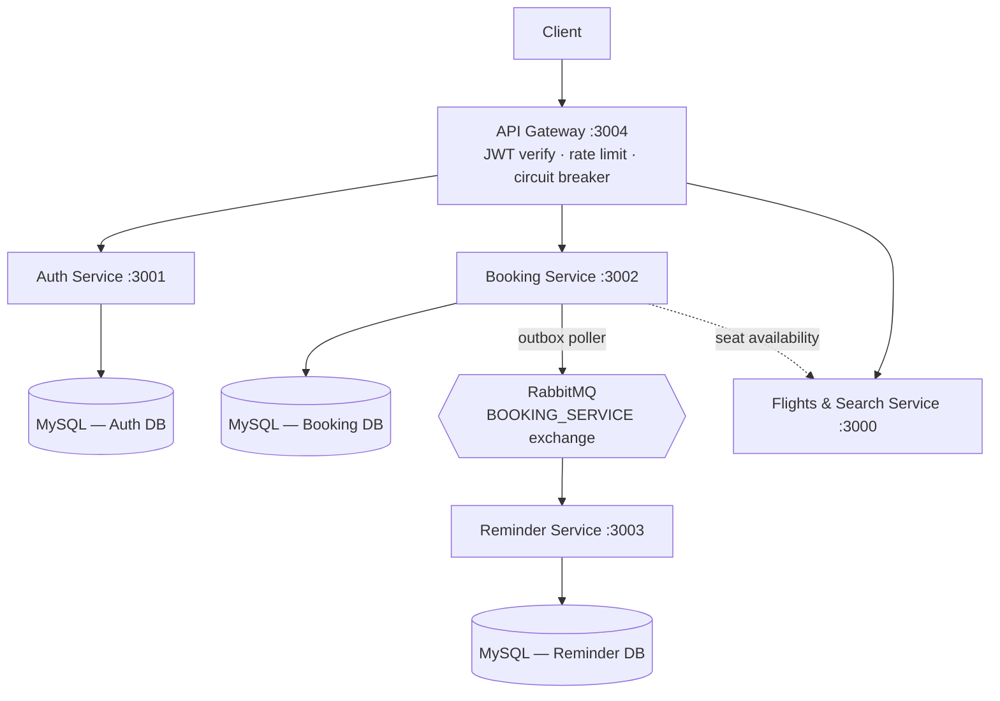
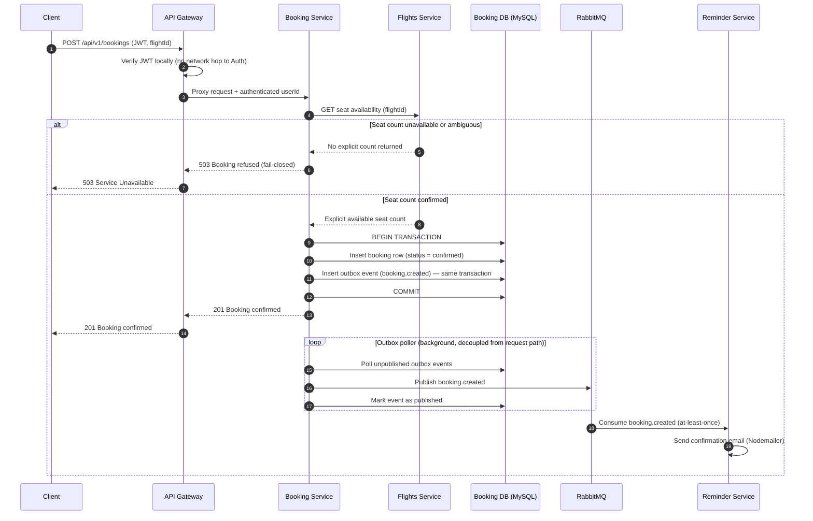
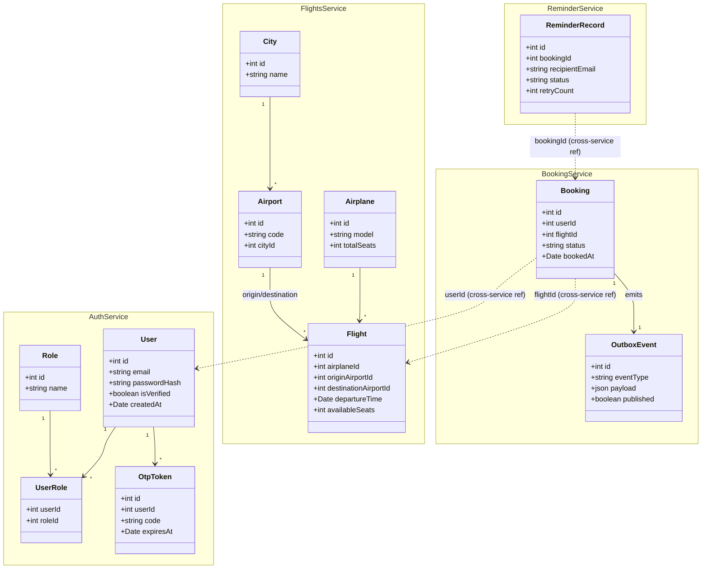

# ✈️ Airline Reservation System

**A production-style distributed booking platform — built to solve the same consistency, coupling, and reliability problems real airline and e-commerce backends face at scale.**

[](https://expressjs.com/)
[](https://www.mysql.com/)
[](https://www.rabbitmq.com/)
[](https://sequelize.org/)
[](#license)

---

### Highlights

- **5 independently deployable services** communicating over REST and an async message broker, each owning its own MySQL schema (database-per-service)
- **Fail-closed seat reservation** — closes a real overbooking race condition present in naive check-then-decrement designs
- **Transactional outbox pattern** — a broker outage can never silently drop a booking confirmation
- **Circuit breaker + local JWT verification** at the API Gateway — no cascading failures, no auth service in the hot path
- **Correlation-ID tracing** across every service boundary, without a full distributed tracing stack
- **Ownership-scoped authorization** enforced on every booking read/cancel via JWT claims

---

## Table of Contents

- [Overview](#overview)
- [Architecture](#architecture)
- [Microservices](#microservices)
- [Diagrams](#diagrams)
- [Design Patterns & Principles](#design-patterns--principles)
- [Key Engineering Decisions](#key-engineering-decisions)
- [Tech Stack](#tech-stack)
- [API Overview](#api-overview)
- [Running Locally](#running-locally)
- [Testing](#testing)
- [License](#license)

---

## Overview

This repository is the **umbrella/reference repo** for the system — it does not contain application code itself. Each service lives in its own repository and is developed, versioned, and deployed independently, following a database-per-service pattern with event-driven communication for cross-service consistency.

The system is deliberately scoped around the hardest problems a real booking platform has to solve: preventing overbooking under concurrent writes, guaranteeing a confirmed booking is never silently lost even if the message broker goes down, and keeping a single request traceable across five independently-deployed services without a shared database or a monolithic call stack.

## Architecture



## Microservices

| Service | Description | Port | Repository |
|---|---|---|---|
| 🛡️ **API Gateway** | Single entry point for all client traffic. Local JWT verification, rate limiting, request proxying, circuit breaking, correlation-ID tracing. | `3004` | [API_GATEWAY](https://github.com/Rohit-hub-coder/API_GATEWAY) |
| 🔐 **Auth Service** | User signup/signin, OTP email verification, JWT issuance, role-based authorization. | `3001` | [auth-service](https://github.com/Rohit-hub-coder/auth-service) |
| 🎫 **Booking Service** | Booking creation, cancellation, and status tracking with concurrency-safe seat reservation. | `3002` | [booking-service](https://github.com/Rohit-hub-coder/booking-service) |
| 🛫 **Flights & Search Service** | Flight, airport, airplane, and city management with relational search. | `3000` | [FLIGHTSANDSEARCHSERVICE](https://github.com/Rohit-hub-coder/FLIGHTSANDSEARCHSERVICE) |
| 📣 **Reminder Service** | Asynchronous booking-confirmation notifications, driven by RabbitMQ. | `3003` | [ReminderService](https://github.com/Rohit-hub-coder/ReminderService) |

---

## Diagrams

<details open>
<summary><strong>Sequence diagram — End-to-end booking flow (fail-closed reservation + outbox pattern)</strong></summary>

This is the system's core transaction, and the one most worth walking an interviewer through: it shows a synchronous, consistency-critical path (seat reservation) composed with an asynchronous, at-least-once delivery path (notification), bridged by the outbox pattern so a broker outage can never silently drop a confirmed booking.



</details>

<details open>
<summary><strong>Class diagram — Consolidated domain model across services</strong></summary>

Each class below is owned by exactly one service's database (database-per-service), but is shown together here to illustrate the relationships that span service boundaries via foreign-key-style references (`userId`, `flightId`) rather than actual foreign keys.



</details>

---

## Design Patterns & Principles

| Pattern / Principle | Where it's used |
|---|---|
| **API Gateway** | Single entry point, offloading auth, rate limiting, and routing from every downstream service |
| **Database-per-Service** | Each service owns an isolated MySQL schema; no cross-service table access |
| **Transactional Outbox** | Booking Service — atomic write of state + event, reliably relayed to RabbitMQ |
| **Circuit Breaker** | Gateway → Flights proxy, via `opossum`, to fail fast instead of cascading latency |
| **Fail-Closed Validation** | Booking Service refuses to proceed on ambiguous downstream responses rather than assuming success |
| **Event-Driven Notification** | Reminder Service reacts to `booking.created` asynchronously, decoupled from the request path |
| **Role-Based Access Control** | Auth Service issues JWTs carrying role claims, enforced downstream |
| **Correlation ID Propagation** | `X-Request-Id` generated/forwarded at the Gateway, logged at every hop |

## Key Engineering Decisions

| Decision | Problem it solves | Trade-off accepted |
|---|---|---|
| **Fail-closed seat reservation** | Prevents overbooking from a non-atomic check-then-decrement race under concurrent requests | Slightly more conservative — a transient Flights-service hiccup can delay a valid booking rather than risk overselling |
| **Transactional outbox** | Guarantees a booking and its `booking.created` event are never inconsistent, even through a broker outage | Adds a polling component and at-least-once (not exactly-once) delivery, so the Reminder Service must tolerate duplicate events |
| **Local JWT verification at the gateway** | Removes a network hop and a single point of failure from every authenticated request | Token revocation isn't instant — a revoked token stays valid until expiry |
| **Circuit breaker on the Flights proxy** | Stops a slow/down Flights service from cascading latency back to the client | Adds a failure mode (open circuit) that must be surfaced clearly to the client as retryable |
| **Correlation IDs, no full tracing stack** | Makes a single request traceable across five services' logs without extra infra | Less powerful than a real distributed tracer (e.g. no automatic span timing) — a deliberate scope trade-off |
| **Ownership-scoped `403` on cross-user access** | Enforces that users can only read/cancel their own bookings | Confirms a resource's existence to an unauthorized caller — `404` would hide that, at the cost of a less informative error |
| **Database-per-service** | Keeps services independently deployable; no schema coupling | Cross-service reads require an API call or event instead of a JOIN, adding latency and eventual consistency |

## Tech Stack

| Layer | Technology |
|---|---|
| Runtime | Node.js, Express.js 5 |
| Databases | MySQL 8, per-service schema isolation |
| ORM | Sequelize + Sequelize CLI (versioned migrations) |
| Messaging | RabbitMQ (`amqplib`), outbox pattern for reliable publishing |
| Auth | JWT (`jsonwebtoken`), bcrypt password hashing, OTP email verification |
| API Gateway | `http-proxy-middleware`, `express-rate-limit`, `opossum` (circuit breaker), `helmet`, `cors`, `morgan` |
| Email (dev) | Nodemailer + Ethereal (disposable test SMTP sandbox) |
| Testing | Jest, Supertest |
| Dev Tooling | Nodemon, Docker (RabbitMQ container) |

## API Overview

All client traffic goes through the gateway at `http://localhost:3004`.

| Method | Path | Auth Required | Description |
|---|---|---|---|
| `POST` | `/api/v1/auth/signup` | No | Register a new user |
| `POST` | `/api/v1/auth/signin` | No | Authenticate and receive a JWT |
| `POST` | `/api/v1/auth/verify-otp` | No | Verify the OTP sent on signup |
| `GET` | `/api/v1/flights/flight` | No | List all flights |
| `GET` | `/api/v1/flights/flight/:id` | No | Get a single flight |
| `POST` | `/api/v1/bookings` | Yes | Create a booking |
| `GET` | `/api/v1/bookings` | Yes | List the authenticated user's bookings |
| `GET` | `/api/v1/bookings/:id` | Yes | Get a single booking (owner only) |
| `PATCH` | `/api/v1/bookings/:id/cancel` | Yes | Cancel a booking (owner only) |
| `GET` | `/api/v1/health` | No | Gateway liveness check |
| `GET` | `/api/v1/health/aggregate` | No | Combined health of all downstream services |

## Running Locally

Each service is independently runnable. Clone all five repos as siblings, then for each:

```bash
git clone <service-repo-url>
cd <service-directory>
npm install
cp .env.example .env   # fill in real values
npm start
```

**Startup order matters** for a full working system:

1. MySQL running locally, with a separate database per service (`AUTH_DB_DEV`, `booking_db_dev`, etc.)
2. RabbitMQ running: `docker run -d --name rabbitmq -p 5672:5672 -p 15672:15672 rabbitmq:3-management`
3. Auth Service → Flights & Search Service → Booking Service → Reminder Service → API Gateway

Once all five are up, verify with:

```bash
curl http://localhost:3004/api/v1/health/aggregate
```

## Testing

The Booking Service includes a Jest test suite covering the fail-closed seat-reservation logic, input validation, and payment-failure rollback:

```bash
cd booking-service
npm test
```

## License

MIT — see [LICENSE](LICENSE) for details.
