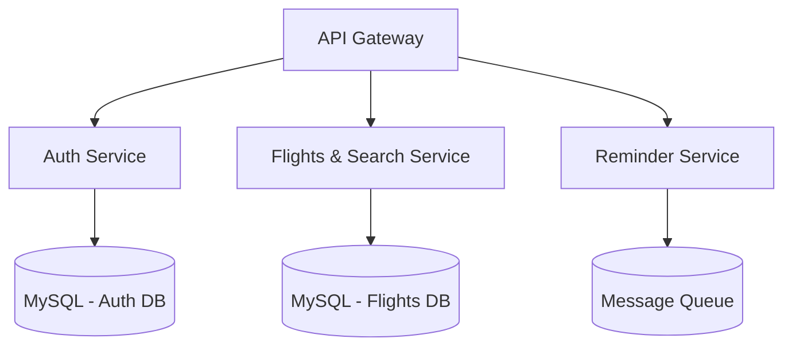

# Airline Reservation System

A distributed airline booking platform built using a microservices architecture, where each service is independently developed, deployed, and scaled.

## Architecture Overview

