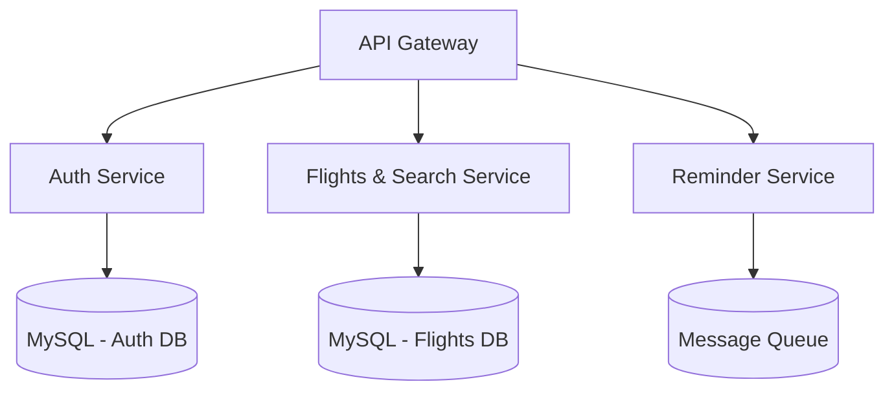

# Airline Reservation System

A distributed airline booking platform built using a microservices architecture, where each service is independently developed, deployed, and scaled.

## Architecture Overview

## Microservices

| Service | Description | Repository |
|---|---|---|
| Auth Service | Handles user registration, login, JWT-based authentication, and authorization | [auth-service](https://github.com/Rohit-hub-coder/auth-service) |
| Flights & Search Service | Manages flight listings, search, and availability | [flights-search-service](https://github.com/Rohit-hub-coder/FLIGHTSANDSEARCHSERVICE) |
| Reminder Service | Sends booking confirmations and flight reminders via message queues | [reminder-service](https://github.com/Rohit-hub-coder/reminder-service) |

## Tech Stack

- **Backend:** Node.js, Express.js
- **Database:** MySQL, Sequelize ORM
- **Authentication:** JWT, bcrypt
- **Messaging:** Message Queues (event-driven communication between services)
- **Deployment:** AWS

## Key Features

- Independent, loosely-coupled microservices communicating via REST APIs
- Secure authentication and authorization using JWT
- Database-per-service pattern for isolated data ownership
- Event-driven notification system using message queues
- Version-controlled schema migrations via Sequelize

## Getting Started

Each microservice has its own setup instructions in its respective repository. Clone the individual service repos linked above to run them locally.
